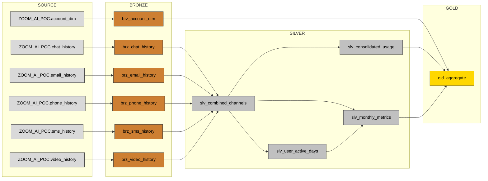
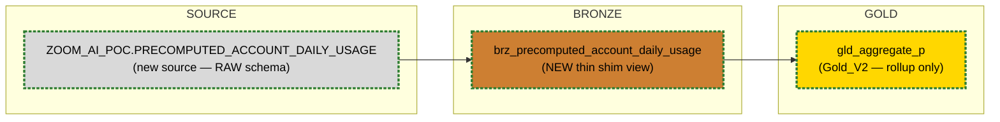

<!--
  Phase 1 deliverable — Mapping & Gap Analysis Report (merged format).
  Cross-reference closure enforced:
    §3 unmapped rows ↔ §5 Gap IDs (1:1, no orphans either direction)
    §3 transforms cite §4 BR IDs; §4 BRs list the §3 rows they serve
    §6 design items resolve §5 Gap IDs
  Profiling source of truth: ZOOM_AI_POC_V2.PUBLIC.DEMO_TRAIL_1_PROFILE_RESULTS (no raw dump here).
-->

# Mapping & Gap Analysis Report — Demo_Trail_1
**Parallel Gold_V2 rebuild of `gld_aggregate` from `RAW.PRECOMPUTED_ACCOUNT_DAILY_USAGE` + existing tables**
_Profiling source of truth:_ `ZOOM_AI_POC_V2.PUBLIC.DEMO_TRAIL_1_PROFILE_RESULTS` (37 rows; verified key-pair connection to `ZOOM_AI_POC_V2`, 2026-06-01)

---

## 1. Executive Summary

**Yes — Gold_V2 is fully reconstructable, with HIGH feasibility (~100%).** The new source
`RAW.PRECOMPUTED_ACCOUNT_DAILY_USAGE` is a clean account/day pre-aggregate (160 rows, 10
accounts × 40 days, grain `(account_id, report_date)` is unique, zero nulls across every
profiled column). Every column `gld_aggregate` consumes — the R28 `active_users` and
`phone_usage` (today via `slv_consolidated_usage`), the R28 `users_active_16plus_days`
(today via `slv_monthly_metrics`), and `region`/`segment`/`is_licensed` (today via
`brz_account_dim`) — is carried directly in the precompute and was verified byte-for-byte
equal in the prior reconciliation (160/160 keys matched, 0 diffs on every measure and
dimension; rolled-up grain also 0 diffs vs the 160 `gld_aggregate` groups). There are **no
hard blockers** and the **gap register is intentionally thin** (one optional source-grain
hardening item, no functional gaps), which is the honest result for this source.

**Approach:** build exactly **two new models** and reuse nothing from the silver chain on the
V2 path. (1) A thin bronze shim `brz_precomputed_account_daily_usage` (view) that types and
normalises the raw table and provides the V1-absence graceful-degradation seam, mirroring the
`brz_account_dim` `adapter.get_relation` pattern. (2) `gld_aggregate_p` (Gold_V2, table) that
reads the shim and performs **only** the final `GROUP BY (date, region, segment, is_licensed)`
rollup — no silver refs, no dimension join, no hash-placeholder fallback. The existing
`slv_consolidated_usage`, `slv_monthly_metrics`, and `brz_account_dim` remain in the project
(they serve the wider metrics layer, R1/R7 windows, `video_usage`, `account_name`) but are
**not on the Gold_V2 path**. Model files are Phase 2, not this phase.

**Risk level: LOW.** The single watch-item is that equivalence is an empirically-verified
data inference on the current 40-day snapshot, not a documented producer contract — addressed
by source tests + a permanent reconciliation model (Phase 2). V1 (`ZOOM_AI_POC`) behaviour is
UNVERIFIED — all checks ran on V2; the shim's empty-shell fallback must be preserved.

---

## 2. Feasibility Verdict

One row per **target model to build**. Counts are over each model's own output columns.

| Target model | Direct | Derivable | Unmapped | Confidence | Verdict |
|--------------|--------|-----------|----------|------------|---------|
| `brz_precomputed_account_daily_usage` (NEW bronze shim) | 8 | 0 | 0 | High | **BUILD — trivial 1:1 typing/normalisation of the source; all 8 business columns map directly.** |
| `gld_aggregate_p` (Gold_V2) | 4 | 4 | 0 | High | **BUILD — 4 grain/dimension cols pass through directly; 4 measures are simple GROUP BY aggregates. Reproduces `gld_aggregate` exactly (0 diffs verified).** |

Overall feasibility: **~100% — every target column is either a direct pass-through or a
single-step aggregate over the new source; zero unmapped columns.**

---

## 3. Mapping Matrix

One row per **target column** across the two models to build. `Mapping Reason` sits right
after `Confidence`. No unmapped rows exist for this source, so no Gap IDs appear inline (see
§5 — the only gap is a source-hardening concern, not a column-level miss). Every transform
cites a `BR ID` (→ §4).

| Target model.column | Source column(s) | Mapping Type | Confidence | Mapping Reason | Gap ID | BR ID | Transformation |
|---------------------|------------------|--------------|------------|----------------|--------|-------|----------------|
| `brz_precomputed_account_daily_usage.report_date` | `PRECOMPUTED_ACCOUNT_DAILY_USAGE.REPORT_DATE` | Direct | High | DATE, 0 nulls, 40 distinct = grain date | — | BR-001 | passthrough |
| `brz_precomputed_account_daily_usage.account_id` | `PRECOMPUTED_ACCOUNT_DAILY_USAGE.ACCOUNT_ID` | Direct | High | TEXT, 0 nulls, 10 distinct = grain key | — | BR-001 | passthrough |
| `brz_precomputed_account_daily_usage.active_users` | `PRECOMPUTED_ACCOUNT_DAILY_USAGE.ACTIVE_USERS` | Direct | High | NUMBER, 0 nulls; = R28 `slv_consolidated_usage.active_users` (0 diffs) | — | BR-001 | passthrough |
| `brz_precomputed_account_daily_usage.phone_usage` | `PRECOMPUTED_ACCOUNT_DAILY_USAGE.PHONE_USAGE_MIN` | Direct | High | FLOAT, 0 nulls; = R28 `slv_consolidated_usage.phone_usage` (0 diffs) | — | BR-002 | rename `PHONE_USAGE_MIN`→`phone_usage` |
| `brz_precomputed_account_daily_usage.users_active_16plus_days` | `PRECOMPUTED_ACCOUNT_DAILY_USAGE.USERS_ACTIVE_16PLUS_DAYS` | Direct | High | NUMBER, 0 nulls; = R28 `slv_monthly_metrics.users_active_16plus_days` (0 diffs) | — | BR-001 | passthrough |
| `brz_precomputed_account_daily_usage.region` | `PRECOMPUTED_ACCOUNT_DAILY_USAGE.REGION` | Direct | High | TEXT, 0 nulls, 4 distinct = `brz_account_dim.region` (0 diffs) | — | BR-003 | `upper(trim())` normalise |
| `brz_precomputed_account_daily_usage.segment` | `PRECOMPUTED_ACCOUNT_DAILY_USAGE.SEGMENT` | Direct | High | NUMBER, 0 nulls, 5 distinct = `brz_account_dim.segment` (0 diffs) | — | BR-004 | `cast(... as integer)` |
| `brz_precomputed_account_daily_usage.is_licensed` | `PRECOMPUTED_ACCOUNT_DAILY_USAGE.IS_LICENSED` | Direct | High | BOOLEAN, 0 nulls, 2 distinct = `brz_account_dim.is_licensed` (0 diffs) | — | BR-005 | `cast(... as boolean)` |
| `gld_aggregate_p.date` | `brz_precomputed_account_daily_usage.report_date` | Direct | High | grain pass-through; `gld_aggregate` aliases its date col `date` (not `report_date`) — must match exactly | — | BR-006 | `report_date as date` |
| `gld_aggregate_p.region` | `brz_precomputed_account_daily_usage.region` | Direct | High | group key; precompute carries region directly, so no dim join / hash fallback | — | BR-007 | GROUP BY key |
| `gld_aggregate_p.segment` | `brz_precomputed_account_daily_usage.segment` | Direct | High | group key; precompute carries segment directly | — | BR-007 | GROUP BY key |
| `gld_aggregate_p.is_licensed` | `brz_precomputed_account_daily_usage.is_licensed` | Direct | High | group key; precompute carries is_licensed directly | — | BR-007 | GROUP BY key |
| `gld_aggregate_p.active_accounts` | `brz_precomputed_account_daily_usage.account_id` | Derived | High | matches `gld_aggregate.active_accounts` (0 diffs); grain is 1 account/day so per-day groups = 1 | — | BR-008 | `count(distinct account_id)` |
| `gld_aggregate_p.active_users` | `brz_precomputed_account_daily_usage.active_users` | Derived | High | sum over group reproduces `gld_aggregate.active_users` (0 diffs) | — | BR-009 | `sum(active_users)` |
| `gld_aggregate_p.phone_usage` | `brz_precomputed_account_daily_usage.phone_usage` | Derived | High | sum-then-round reproduces `gld_aggregate.phone_usage` (0 diffs, tol 0.01) | — | BR-010 | `round(sum(phone_usage), 2)` |
| `gld_aggregate_p.users_active_16plus_days` | `brz_precomputed_account_daily_usage.users_active_16plus_days` | Derived | High | sum over group reproduces `gld_aggregate.users_active_16plus_days` (0 diffs) | — | BR-011 | `sum(users_active_16plus_days)` |

Matrix size: **16 target columns** — **8 Direct (bronze shim) + 4 Direct (Gold_V2 grain/dims)
+ 4 Derived (Gold_V2 measures) = 12 Direct, 4 Derived, 0 Unmapped.**

---

## 4. Business Rules & Transformations Catalogue

Each BR explains a Transformation used in §3. `Serves` lists the §3 rows that use it. SQL is
valid dbt/Snowflake as it would appear in the model.

### BR-001: Typed pass-through of pre-aggregated columns
- **Serves (§3 rows):** `brz_…account_daily_usage.{report_date, account_id, active_users, users_active_16plus_days}`
- **Rule:** Carry the precompute's date, account key, and the two already-aggregated NUMBER measures straight through with no value change; the shim only relabels/types.
- **Logic (dbt/Snowflake):** `select report_date, account_id, active_users, users_active_16plus_days from {{ source('ZOOM_AI_POC','precomputed_account_daily_usage') }}`
- **Risk:** Low — 0 nulls, types already correct in profile.

### BR-002: Phone-usage rename to gold-input name
- **Serves (§3 rows):** `brz_…account_daily_usage.phone_usage`
- **Rule:** The source column is `PHONE_USAGE_MIN`; downstream gold expects `phone_usage`. Rename only — value identical.
- **Logic (dbt/Snowflake):** `phone_usage_min as phone_usage`
- **Risk:** Low — verified equal to silver R28 `phone_usage` (0 diffs).

### BR-003: Region normalisation
- **Serves (§3 rows):** `brz_…account_daily_usage.region`
- **Rule:** Match `brz_account_dim` house style — uppercase/trim region for stable grouping.
- **Logic (dbt/Snowflake):** `upper(trim(region)) as region`
- **Risk:** Low — already 4 clean distinct values (NAMER/APAC/EMEA/LATAM), 0 nulls.

### BR-004: Segment integer cast
- **Serves (§3 rows):** `brz_…account_daily_usage.segment`
- **Rule:** Enforce integer type to match `brz_account_dim.segment` and the gold group key.
- **Logic (dbt/Snowflake):** `cast(segment as integer) as segment`
- **Risk:** Low — source already NUMBER, 5 distinct (1–5), 0 nulls.

### BR-005: Licensed boolean cast
- **Serves (§3 rows):** `brz_…account_daily_usage.is_licensed`
- **Rule:** Enforce boolean type to match `brz_account_dim.is_licensed`.
- **Logic (dbt/Snowflake):** `cast(is_licensed as boolean) as is_licensed`
- **Risk:** Low — source already BOOLEAN, 2 distinct, 0 nulls.

### BR-006: Date alias to gold contract
- **Serves (§3 rows):** `gld_aggregate_p.date`
- **Rule:** `gld_aggregate` exposes its date column as `date`, not `report_date`. Gold_V2 must alias identically so the reconciliation join and any downstream consumer match.
- **Logic (dbt/Snowflake):** `report_date as date`
- **Risk:** Low — load-bearing naming detail; verified against existing model.

### BR-007: Dimension pass-through as group keys (no dim join / no hash fallback)
- **Serves (§3 rows):** `gld_aggregate_p.{region, segment, is_licensed}`
- **Rule:** The precompute embeds region/segment/is_licensed per account/day (verified 0 diffs vs `brz_account_dim` in V2), so Gold_V2 groups on them directly — the `brz_account_dim` LEFT JOIN and the V1 `mod(hash(account_id))` placeholder COALESCE are unnecessary on this path.
- **Logic (dbt/Snowflake):** `group by date, region, segment, is_licensed`
- **Risk:** Low (V2). Watch: V1 dimension parity is UNVERIFIED (see §5 GAP-01 note on V1).

### BR-008: Active-account count
- **Serves (§3 rows):** `gld_aggregate_p.active_accounts`
- **Rule:** Distinct accounts per group, identical to the existing model.
- **Logic (dbt/Snowflake):** `count(distinct account_id) as active_accounts`
- **Risk:** Low — 0 diffs vs `gld_aggregate` (each group = 1 account at this grain).

### BR-009: Active-users sum
- **Serves (§3 rows):** `gld_aggregate_p.active_users`
- **Rule:** Sum the per-account active_users into the group.
- **Logic (dbt/Snowflake):** `sum(active_users) as active_users`
- **Risk:** Low — 0 diffs vs `gld_aggregate`.

### BR-010: Phone-usage sum, rounded
- **Serves (§3 rows):** `gld_aggregate_p.phone_usage`
- **Rule:** Sum phone minutes per group and round to 2 dp, matching the existing model exactly.
- **Logic (dbt/Snowflake):** `round(sum(phone_usage), 2) as phone_usage`
- **Risk:** Low — 0 diffs (tol 0.01) vs `gld_aggregate`.

### BR-011: 16+-day active-users sum
- **Serves (§3 rows):** `gld_aggregate_p.users_active_16plus_days`
- **Rule:** Sum the per-account 16+-day count into the group.
- **Logic (dbt/Snowflake):** `sum(users_active_16plus_days) as users_active_16plus_days`
- **Risk:** Low — 0 diffs vs `gld_aggregate`.

---

## 5. Gap & Risk Register

**This register is intentionally thin — by design for this source.** The precompute carries
100% of `gld_aggregate`'s inputs and was verified byte-for-byte equal, so there are **no
unmapped columns in §3 and therefore no column-level functional gaps.** The single registered
gap is a source-governance hardening item (not a §3 column miss); it is recorded so §6 has a
design item to attach to. Coverage the precompute does NOT carry (R1/R7 windows, `video_usage`,
row-level detail, finer active-day buckets, `account_name`) is **out of scope** for Gold_V2 —
those belong to the wider silver layer and are NOT inputs to `gld_aggregate`, so they are not
gaps for this rebuild.

| Gap ID | Type | Description | §3 rows affected | Severity | Resolved by (§6) | Mitigation |
|--------|------|-------------|------------------|----------|------------------|------------|
| GAP-01 | Source governance / grain enforcement | The new source has no `_sources.yml` registration, no grain/freshness tests, and equivalence to silver R28 is an empirically-verified inference (current 40-day snapshot) rather than a documented producer contract. A future duplicate `(account_id, report_date)` or an upstream window-definition change would silently corrupt the Gold_V2 rollup. | Underpins the integrity of all 8 `brz_precomputed_account_daily_usage.*` rows and the 4 derived `gld_aggregate_p` measures | Medium | §6.1 `brz_precomputed_account_daily_usage` + source registration | Register the source in `_sources.yml`; add `not_null(account_id, report_date)` + `unique` on the combo + freshness on `_LOADED_AT`; build the permanent reconciliation model (Phase 2) so CI fails on any drift vs `gld_aggregate`. |

**V1 note (not a closure gap):** V1 (`ZOOM_AI_POC`) presence and region/segment parity vs the
V1 hash placeholders are UNVERIFIED — all checks ran on V2. This is handled architecturally by
the shim's empty-shell fallback (§6.1), not by a column gap, so it carries no Gap ID.

Closure check: GAP-01 is the only gap; it is referenced as the source-governance umbrella over
the §3 rows listed and is resolved by §6.1. No orphan gaps; no unmapped §3 row lacks coverage
(there are none).

---

## 6. New / Altered Tables Design

### 6.1 New tables (do not exist today)

| Model | Layer | Purpose | Resolves Gap ID(s) | Sketch |
|-------|-------|---------|--------------------|--------|
| `brz_precomputed_account_daily_usage` | Bronze (view) | Thin shim over `RAW.PRECOMPUTED_ACCOUNT_DAILY_USAGE`: type/normalise the 8 business columns (BR-001..BR-005), drop `_LOADED_AT` from the projection (audit only), and provide the V1-absence graceful-degradation seam via the `adapter.get_relation` empty-shell pattern (mirrors `brz_account_dim`). Source registered in `_sources.yml` with `not_null(account_id, report_date)` + `unique(account_id, report_date)` + freshness on `_LOADED_AT`. | GAP-01 | ` select report_date, account_id, active_users, phone_usage_min as phone_usage, users_active_16plus_days, upper(trim(region)) as region, cast(segment as integer) as segment, cast(is_licensed as boolean) as is_licensed from {{ source('ZOOM_AI_POC','precomputed_account_daily_usage') }}  <typed empty shell> ` |
| `gld_aggregate_p` | Gold (table) | Gold_V2: read the shim and roll up to `(date, region, segment, is_licensed)` producing `active_accounts`, `active_users`, `phone_usage`, `users_active_16plus_days` (BR-006..BR-011). No silver refs, no dim join, no hash fallback. Side-by-side with `gld_aggregate`. | GAP-01 (its integrity depends on the source tests) | `select report_date as date, region, segment, is_licensed, count(distinct account_id) as active_accounts, sum(active_users) as active_users, round(sum(phone_usage),2) as phone_usage, sum(users_active_16plus_days) as users_active_16plus_days from {{ ref('brz_precomputed_account_daily_usage') }} group by 1,2,3,4` |

### 6.2 Altered tables (existing, extended on the V2 path)

| Model | Layer | Change | Resolves Gap ID(s) | Notes |
|-------|-------|--------|--------------------|-------|
| _(none)_ | — | No existing model is altered on the Gold_V2 path. | — | `slv_consolidated_usage`, `slv_monthly_metrics`, `brz_account_dim` are bypassed (not modified) for Gold_V2; they remain unchanged and continue to serve the wider metrics layer (R1/R7, `video_usage`, `account_name`). |

---

## 7. Lineage — current vs target

### 7.1 Current state (existing layers → `gld_aggregate`)
Source: `lineage_gld_aggregate.mmd` (17 nodes / 18 edges).

### 7.2 Target state (new source + shim → Gold_V2)
Source: `target_lineage_gld_aggregate_v2.mmd`.

**Read of the contrast:** Gold_V2 collapses a 17-node, 4-layer-deep DAG (6 sources → 6 bronze
→ 4 silver → gold, plus the `brz_account_dim` dimension join) into a 3-node linear path (1
source → 1 bronze shim → Gold_V2). The silver layer and the dimension join are entirely off
the V2 path; the existing chain is retained only for the broader metrics it still uniquely
produces.
