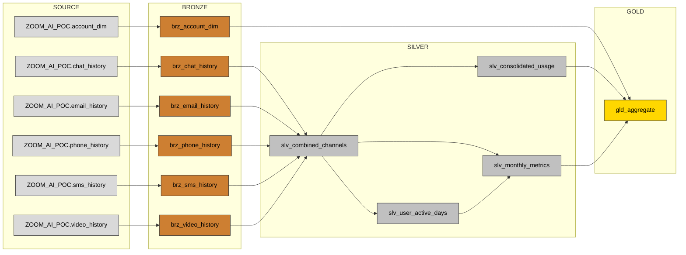

# gld_aggregate — upstream lineage (gold → source)

## Upstream lineage (by layer)

**SOURCE** (6)
- `ZOOM_AI_POC.account_dim`
- `ZOOM_AI_POC.chat_history`
- `ZOOM_AI_POC.email_history`
- `ZOOM_AI_POC.phone_history`
- `ZOOM_AI_POC.sms_history`
- `ZOOM_AI_POC.video_history`

**BRONZE** (6)
- `brz_account_dim`
- `brz_chat_history`
- `brz_email_history`
- `brz_phone_history`
- `brz_sms_history`
- `brz_video_history`

**SILVER** (4)
- `slv_combined_channels`
- `slv_consolidated_usage`
- `slv_monthly_metrics`
- `slv_user_active_days`

**GOLD** (1)
- `gld_aggregate`  ← TARGET

## Model-level flow

> This Mermaid diagram renders in GitHub, GitLab, VS Code, and PR review with
> zero dependencies. For a static image: a `lineage_*.png` is written when
> Graphviz `dot` is installed, **or** paste `lineage_*.mmd` into
> https://mermaid.live and export PNG/SVG (no local install needed).
